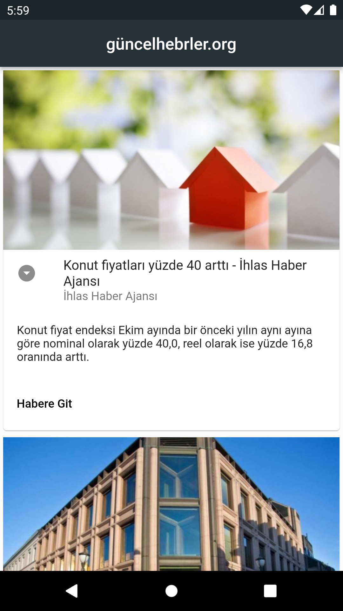
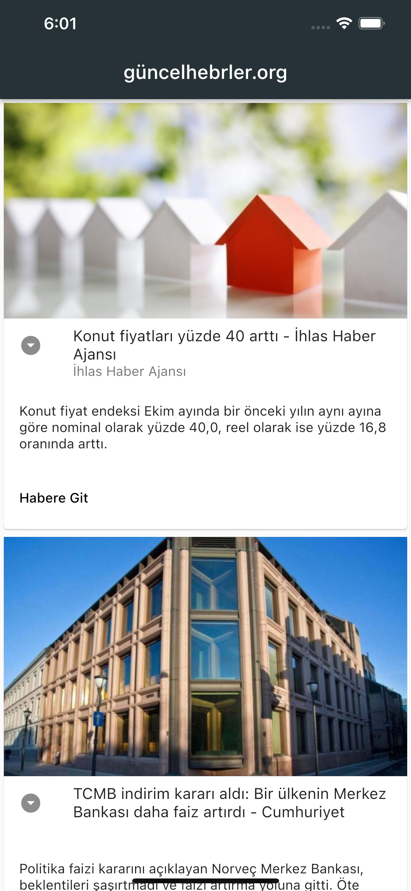

#### Run commands:
```
flutter pub get
```
```
flutter run
```
## APK Install
<a href="image/güncelahberler.apk" download> Click to download APK </a>
# Güncel Haber App
Mobile application showing Turkey's most up-to-date and popular headlines.
## Badges

Use it as you want

[](https://github.com/tterb/atomic-design-ui/blob/master/LICENSEs)
[](https://opensource.org/licenses/)

  
## Used technologies

**Client:** Fluter Widget
##
**Server:** Flutter, API
## Making
- Ease of Use.
- Flutter 
- https://newsapi.org/


## Web App in Web Site
http://oguzhancart.likesyou.org/

## Api Website
<a href="https://newsapi.org/">https://newsapi.org/</a>


## For Support
For support, send an email to oguzhancart1@gmail.com or you are invited to our telegram channel https://t.me/vsform_tr  

## Codpen.io
[Codpen account link](https://codepen.io/oguzhan1881)
## Github Account Link
[Github account link](https://github.com/oguzhan18)
## Mail
oguzhancart1@gmail.com
# Instagram Account Link
<a target="_blank" href="https://www.instagram.com/oguzhan_cart/">
  
</a>
<a target="_blank" href="https://twitter.com/OguzhanCart">
  
</a>
<a target="_blank" href="https://github.com/oguzhan18">
  
</a>
#### And Result:


